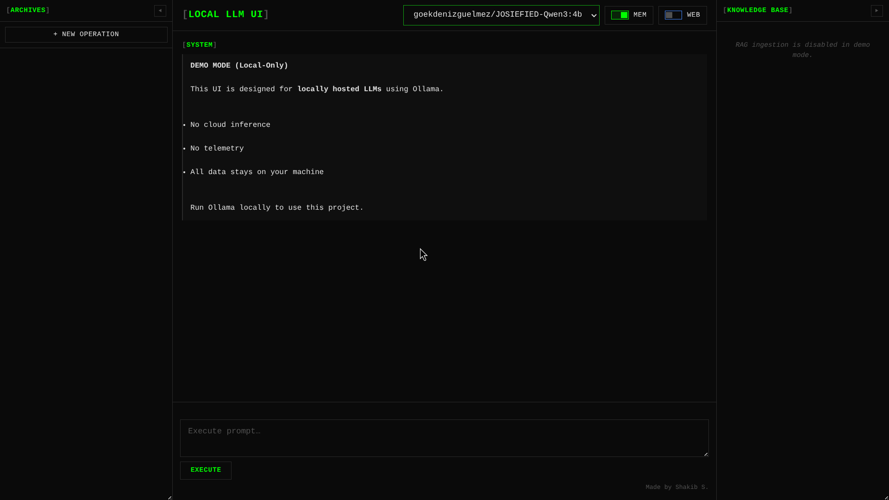

# Local-LLM-Web-UI

A local-first web interface for interacting with **locally hosted language models** using Ollama.  
This project focuses on **privacy, offline inference, and system-level understanding**, rather than cloud-based AI workflows.

All inference, memory, and data remain on the user’s machine.  
No external APIs. No telemetry. No cloud inference.

---

## 📸 Screenshots

### Main Interface


# Features

-- Local-only LLM interaction via Ollama.

-- FastAPI backend with **streaming token responses**.

-- React (Vite) frontend with real-time updates.

-- Conversation persistence using local storage (JSON).

-- Tool-aware inference pipeline (optional web search).

-- Clean, demo-friendly UI designed for portfolio review.

-- Explicit demo-mode messaging to avoid confusion.

---

# System Architecture

The application is built as three cooperating layers:

**Frontend (React + Vite)**

Handles user interaction, model selection, and real-time rendering of streamed responses.  
Uses safe Markdown rendering and avoids direct HTML injection.

**Backend API (FastAPI)**

Manages conversations, streams responses from Ollama, and coordinates optional tools.  
Implements async request handling and server-to-client streaming.

**Local LLM Runtime (Ollama)**

Runs language models fully offline.  
Streams tokens incrementally to the backend, enabling low-latency UI updates.

---

# Demo Mode (Important)

This repository is intended as a **portfolio showcase**.

There is **no live online inference demo**.

Reason:
- Language models run locally via Ollama
- No cloud inference is used
- This preserves privacy and avoids misuse

The UI and system design can be reviewed directly from the code and screenshots.  
To experience full functionality, the project must be run locally.

---

# Requirements / Installation Guide

**🧠 System Requirements**

Python 3.10+

Node.js 18+

Ollama installed locally with at least one model pulled

---

**⚙️ Backend Setup**

```bash
cd backend
pip install fastapi uvicorn httpx
python main.py
```

The backend runs at:

http://localhost:8000


🖥️ Frontend Setup

```
cd frontend
npm install
npm run dev
```

The frontend runs at:

http://localhost:5173


🧩 Ollama Model Setup (Example)
```
ollama pull llama3.2:3b
```

Any locally installed Ollama model can be selected from the UI.

**Why This Exists**

Most AI demos assume cloud APIs and external services.

This project was built to explore the opposite direction:

Local inference.
Explicit constraints.
System-level understanding.

The goal is not to replace hosted AI services, but to understand how local-first AI systems are designed, connected, and exposed through a web interface.

# 🧠 Internals

**Streaming Responses**

The backend streams tokens as they are generated.
The frontend renders output incrementally, improving perceived responsiveness.

**Conversation Persistence**

Chats are stored locally and can be resumed across sessions.

**Security-Aware Design**

No external scripts.
No browser-side secrets.
No cloud dependencies.

The system is intentionally constrained and transparent.

# 🗺️ Roadmap

Local RAG ingestion (documents, notes).

Vector-based retrieval for context injection.

Improved tool orchestration.

Optional authentication for multi-user setups.

# 👤 Author

**Shakib S.**

Aspiring backend / platform engineer
Interested in local-first systems, AI tooling, and infrastructure-aware development.

# 📄 License

MIT License
